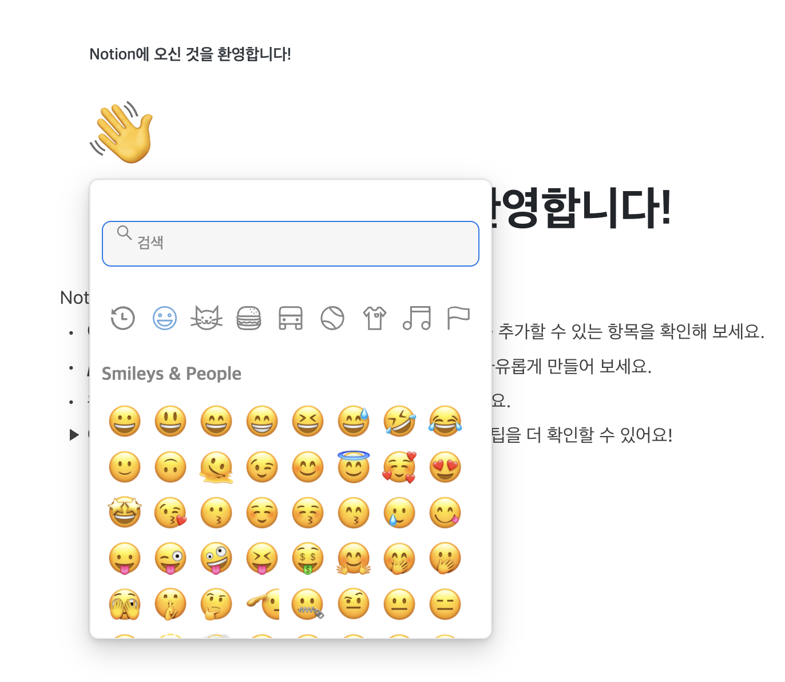
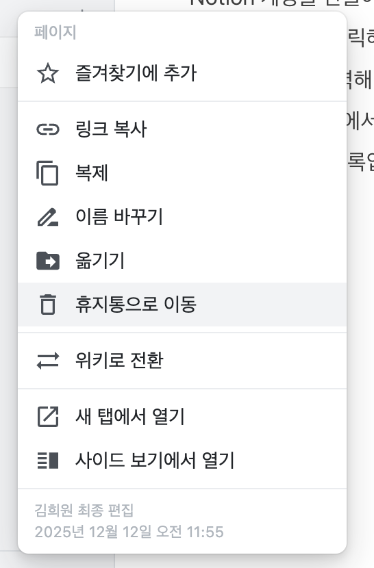
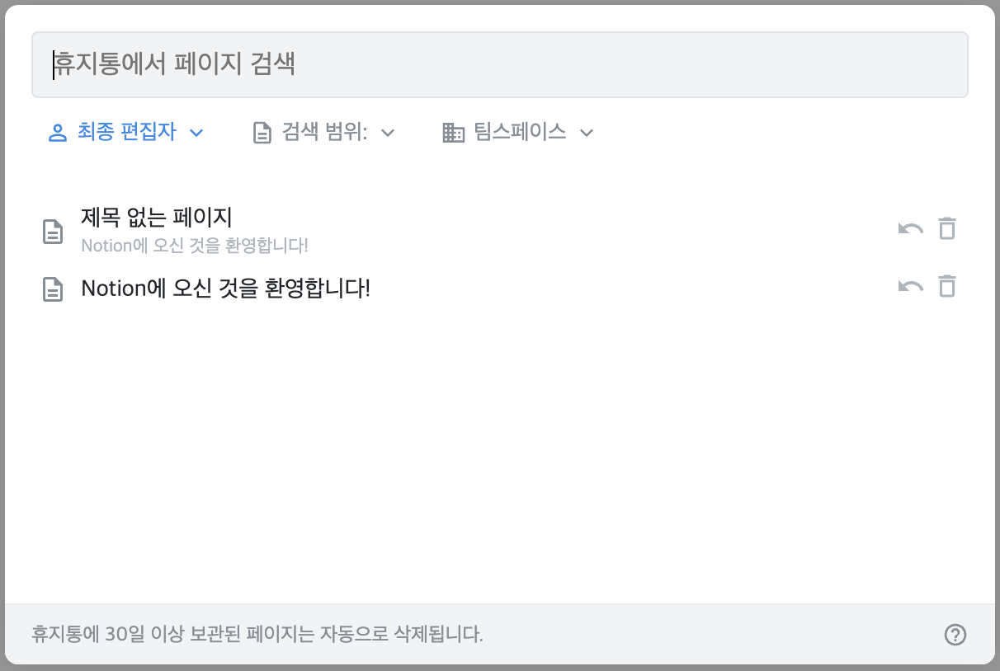
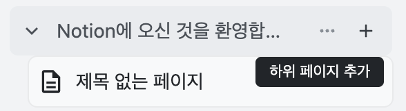
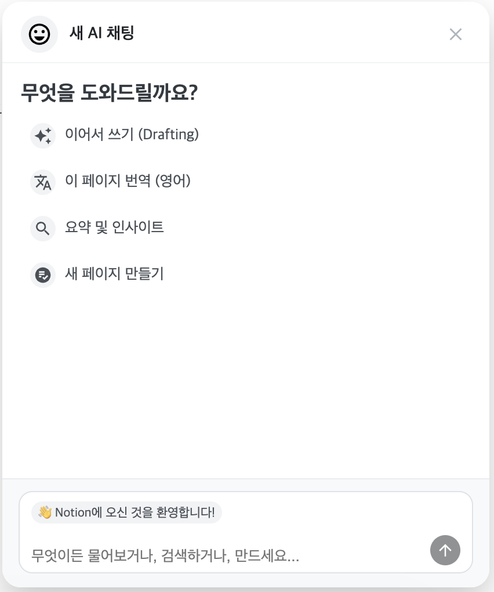
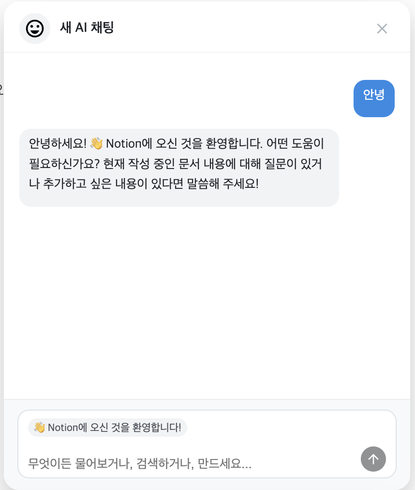
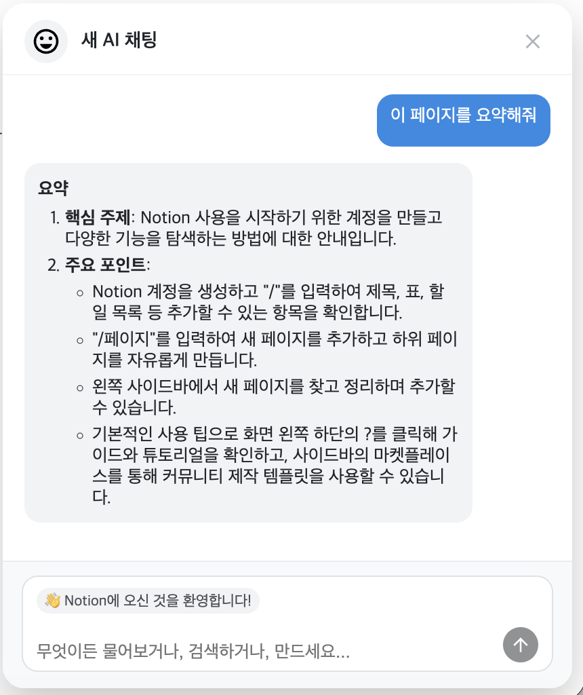
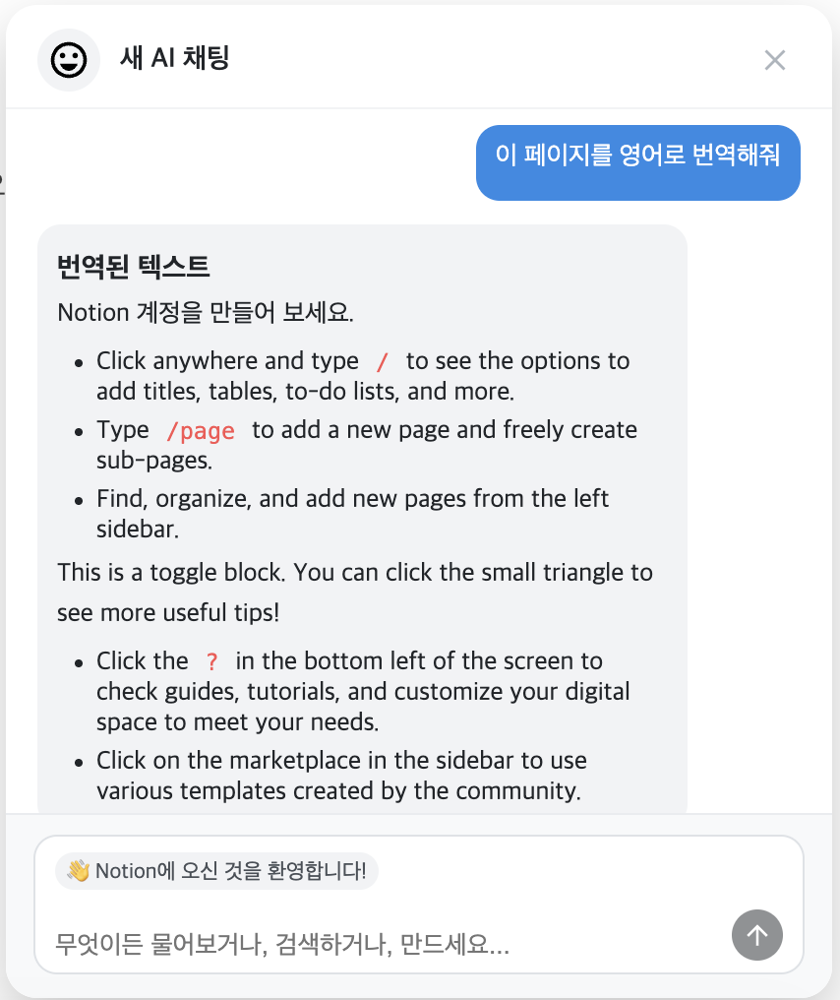
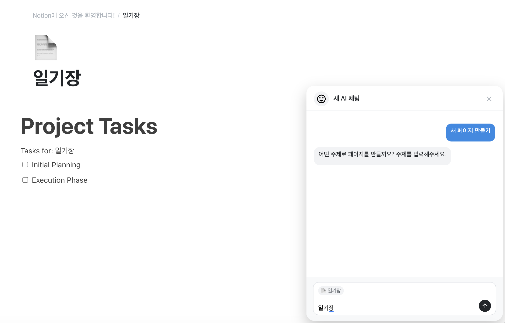
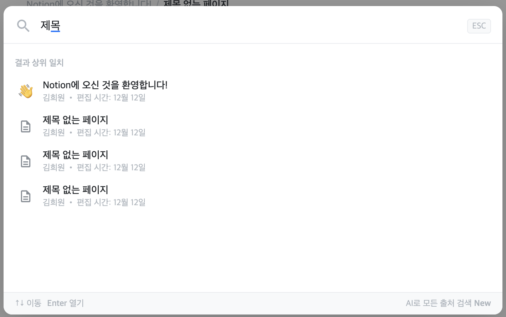

# notionclone

전기정보공학부 김희원 개인 프로젝트

## Demo video

https://www.youtube.com/watch?v=aHE7seTQfSg

### 프로젝트 설명

Notion clone은 `blocknote` 라이브러리를 기반으로 Notion의 핵심 UI와 block editor 아키텍쳐를 정교하게 구현한 프로젝트입니다. Local storage를 사용해 복잡한 페이지 계층 구조와 휴지통 로직(임시 삭제, 영구 삭제, 임시 삭제 복구)을 안정적으로 관리하며, Breadcrumb과 sidebar navigation을 통해 매끄러운 UX를 제공합니다. 또, AI Assistant도 도입되어, 현재 페이지의 문맥을 실시간으로 파악하여 현재 페이지 요약, 번역, 이어 쓰기, 하위의 새로운 페이지 생성 등의 기능을 지원합니다.

## Plan

2주차에 시험(기말고사)이 많아서 1주차에 2주차의 개발 대부분까지 하려고 합니다.. ㅠㅠ

### 1주차 (`main` branch)

- [x] Sidebar 열기 / 닫기 (`Sidebar.tsx`, `SidebarItemRow.tsx`)
- [x] Sidebar hover 시 나오는 설명은 공통 컴포넌트 (`HoverIconButton.tsx` 사용)
- [x] 검색창 (기능 없이 UI만 구현- `SearchOverlay.tsx`)
- [x] Page UI (`PageHeader.tsx` & `PageEditor.tsx`)
- [x] 기본 페이지 (`notionWelcome.ts`)
- [x] BreadCrumb (현재 hierarchy 상 위치 표시, BreadCrumb를 클릭함으로써 페이지 간 이동 가능 - `BreadCrumb.tsx`, 계산은 `breadCrumbs.ts` 함수가)
- [x] 기본 Notion 기능들은 `blocknote` 라이브러리 사용
- [x] `/page`로 새로운 페이지 생성하고, page 간 hierarchy 확립
  - [x] `/page`는 `blocknote`의 기본 기능들에 없기 때문에 따로 `NewPageSlashItem.tsx`를 정의하여 custom하여 사용
  - 앞으로 custom된 기능들은 `customSlashItems/`에 정의 예정
- [x] Page 관리 (via custom hook `usePages.ts`)
- [x] Page hierarchy 정보를 localStorage에 저장 (`pageStorage.ts` util 함수가 관리)
- [x] Sidebar에서도 -개인 페이지의 `+` 클릭하거나 우측 상단의 연필 이모티콘 클릭 - page 생성 가능 (Sidebar의 root page 목록은 동적으로 렌더링된다)
- [x] 휴지통 (기능 없이 UI만 구현- `TrashCanOverlay.tsx`)

### 2주차 (`week2` branch)

- [x] `PageHeader` (title, icon 모두) 수정 가능하도록- `emoji-picker-react` 라이브러리 사용
- [x] (임시 & 영구 모두) 페이지 삭제하는 로직 `usePages.ts`에 구현
- [x] Sidebar에서 개별 페이지의 `...` 클릭시 `PageMenuOverlay` UI 나오도록
- [x] Sidebar의 개별 페이지 탭 우측 `...` 아이콘에서 페이지 삭제 기능
- [x] Sidebar의 개별 페이지 탭 우측 `+` 아이콘에서 해당 페이지의 하위 (Child) 페이지 생성 가능
- [x] Page 삭제 시 휴지통으로 그 페이지 이동하도록- 임시로 지운 페이지 목록 역시 localStorage로 관리한다
- [x] 휴지통에서 지워야 localStorage에서 그 페이지 지움
- [x] Sidebar의 개별 페이지에서 `>` 클릭 시 page hierarchy 보이도록
- [x] AI assistant UI 생성

### 3주차 (`week3` branch)

- [x] OPENAI API 연결- 편의상 frontend에서 바로 연결
- [x] OPENAI API로 notion 작업할 수 있도록
  - [x] 이어서 쓰기 기능
  - [x] 번역 기능
  - [x] 요약 및 인사이트 기능
  - [x] 새로운 페이지 생성
- [x] 검색 기능 추가
- [x] Color system 재정리
- [x] 각 페이지에 맞게 AI Assistant의 UI도 변경되도록

## How to run this project

### Vite Frontend

Run the project by:

```bash
# move to the frontend project directory
cd notionclone-fe

# install dependencies if needed
npm install

# run this project
npm run dev
```

This project will open at `http://localhost:5173`

## Directory Structure

### Frontend

- `src/`
  - `constants/`
  - `hooks/`
  - `pages/`
  - `styles/`
  - `types/`
  - `ui/`
  - `utils/`
  - `main.tsx`

## 1주차 과제- 기획

### 서비스 목적

전에 WYSIWYG 에디터를 frontend에서 관리해본 경험이 있었는데, 해본 frontend 개발 중에서 난이도가 제일 높게 느껴졌었다. 그래서 이번 개인 프로젝트로는 유명한 마크다운 에디터인 Notion을 따라하는 클론 프로젝트를 진행하고자 한다. 그렇기에 이 서비스의 목적은 개인적인 기술적 학습 목적이 강하고, 아래의 기술들을 습득하고자 한다.

- Block editor architecture 학습
- UI/UX component 구조화
- Page hierarchy 관리
- Local Storage
- Slash Command (`/`) 구조 설계

### 서비스 타겟

이 서비스는 학습 목적이 강하기 때문에 이 서비스의 타겟은 개발자 본인이다. 기존 노션의 서비스 타겟을 생각해보면, 생산성 도구를 자주 사용하는 사람들 (일정 관리, 프로젝트 문서화, 회의록 정리) / 빠르고 가벼운 에디터를 원하는 사용자들 등이 있겠다.

### 핵심가치

- Simple하게 조작 가능
- 빠르고 가벼운 UX
- Hierarchical page structure
- 확장 가능한 Slash command
- 사용자 친화적인 Sidebar navigation

### Painpoint, wowpoint

#### Painpoint

무거운 서비스가 될 듯 하다.

#### Wowpoint

구현하면서 개발 실력이 많이 성장할 것으로 예상된다.

### 스케치

스케치는 이 `README.md` 파일을 참고해주세요.

## Implemented Features

### Week 1

- 기본 화면 (`Sidebar.tsx`, `PageHeader.tsx`, `PageEditor.tsx` components, contents from `notionWelcome.ts`, `blocknote` library used)

  

- 검색창 (`SearchOverlay.tsx` component)

  

- 새로운 페이지는 `/page`로 생성 가능- custom해서 만든 기능 (`NewPageSlashItem.tsx`)

  

- 이렇게 만든 페이지는 기존 페이지에 아래 사진처럼 표시된다.

  

- Breadcrumb (Shows current page hierarchy, `BreadCrumb.tsx` component, `breadCrumbs.ts` utility function)

  

- 그 외에도 Sidebar의 위와 아래에서 페이지 생성 가능- 여기서 만들어진 페이지는 모두 (page hierarchy의) root로 간주

  

  

  

- `휴지통` 클릭 시 (`TrashCanOverlay` component)

  

### Week 2

- Header icon 및 제목 편집 가능
  

- 개별 페이지의 `...` 클릭 시 (`PageMenuOverlay` component)- `휴지통으로 이동` 기능 구현 완료
  

- `휴지통` 클릭 시 기능 추가- 영구 삭제 및 복구 가능
  

- 개별 페이지의 `+` 클릭 시 하위 페이지 생성 기능
  

- 우측 하단의 아이콘 클릭시 나오는 AI Assistant- 현재 page를 감지해서 input section에 현재 페이지 표시 및 현재 페이지를 기준으로 작업을 진행함
  

### Week 3

- 작동하는 AI Assistant- 기본적인 질문 가능
  

- 작동하는 AI Assistant- 현재 페이지 요약 가능
  

- 작동하는 AI Assistant- 현재 페이지 번역 가능
  

- 작동하는 AI Assistant- 현재 페이지에서 새로운 자식 페이지 생성 가능
  

- `SearchOverlay`에 검색 기능 추가
  
